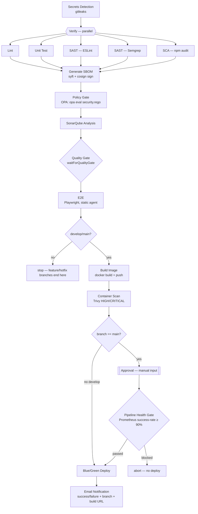
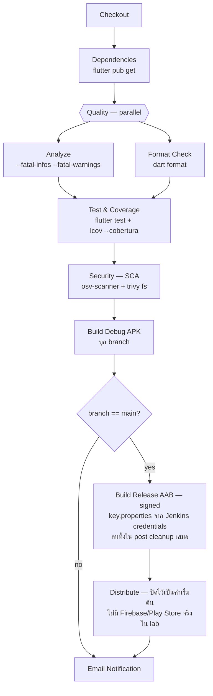

# Taskflow CI/CD Architecture (Lab 10 Capstone)

สองพาย์ไลน์แยกอิสระจากกัน แชร์ repo เดียวกัน (`JenkinLabs`, multibranch job คนละตัว คนละ
`scriptPath`) — `taskflow-multibranch` (`Jenkinsfile` ที่ repo root, สำหรับ taskflow-api)
และ `taskflow-mobile` (`mobile/Jenkinsfile.mobile`, สำหรับ taskflow-mobile Flutter app)

## taskflow-api — `Jenkinsfile`

**Gate ทั้งหมดเรียงตามลำดับจริง:**
1. Secrets Detection (gitleaks) — บล็อกทันทีถ้าเจอ secret หลุดใน commit
2. Verify (parallel) — Lint / Unit Test / SAST ×2 / SCA ต้องผ่านทุกตัว
3. Generate SBOM + เซ็นด้วย cosign (ไม่ block แต่เป็น supply-chain evidence)
4. Policy Gate — OPA deny ถ้ามี CVE critical จาก SCA
5. SonarQube Analysis → Quality Gate — code quality/coverage threshold
6. E2E (Playwright) — เฉพาะหลังผ่าน Quality Gate
7. Build Image + Container Scan (Trivy) — เฉพาะ `develop`/`main`
8. Approval (manual, เฉพาะ `main`) — ต้องมีคนกด approve ก่อน production
9. Pipeline Health Gate (เฉพาะ `main`) — เช็ค build success rate จาก Prometheus ก่อนปล่อย
10. Blue/Green Deploy — สลับ traffic, rollback อัตโนมัติถ้า smoke test fail
11. Email Notification — ทุกผลลัพธ์ (success/failure)

## taskflow-mobile — `mobile/Jenkinsfile.mobile`

## ทำไมสอง pipeline ถึงแยกกัน

- คนละ runtime/toolchain (Node.js vs Flutter/Android SDK ~5GB) — รวมกันจะทำให้ agent image
  ใหญ่และช้าโดยไม่จำเป็นสำหรับแอปที่ไม่เกี่ยวข้อง
- คนละจังหวะการ deploy จริง (taskflow-api deploy ขึ้น k3d ทุก merge, taskflow-mobile ต้อง build
  AAB ให้คนโหลดไปทดสอบ ไม่ได้ deploy อัตโนมัติแบบเดียวกัน)
- Approval/health gate ของฝั่ง production deploy (blue/green) ไม่เกี่ยวกับ mobile release เลย

## Agent placement

| Stage กลุ่ม | agent | เหตุผล |
|---|---|---|
| Secrets/Lint/Test/SAST/SCA/SBOM/Policy/Sonar/Quality Gate (api) | Kubernetes dynamic pod (`kind-taskflow` cloud) | Stateless, ไม่ต้องคุย docker daemon ตรงๆ |
| E2E, Build Image, Container Scan(นอกเหนือจาก Trivy pod), Blue/Green Deploy | static `linux-build-agent` | ต้องคุย docker daemon/kubeconfig ภายนอกจริง — Docker Desktop บล็อก nested DinD ใน k8s pod (ดู comment ใน Jenkinsfile) |
| ทุก stage ของ taskflow-mobile | static `linux-build-agent` (docker agent เดียวตลอด pipeline) | pub-cache/.gradle ต้องอยู่ container เดียวกันตลอด ไม่งั้นหายระหว่าง stage |

## Observability & Notification

- Prometheus (`/prometheus/` metrics endpoint) + Grafana dashboard "Jenkins Pipeline Health"
  (Lab 09) — ข้อมูลที่ Pipeline Health Gate query มาใช้ตัดสินใจ
- MailHog (container `mailhog`, network เดียวกับ `jenkins-lab01`) เป็น SMTP catcher local —
  ดู notification จริงได้ที่ http://localhost:8025 โดยไม่ต้องมี Slack workspace/token จริง
